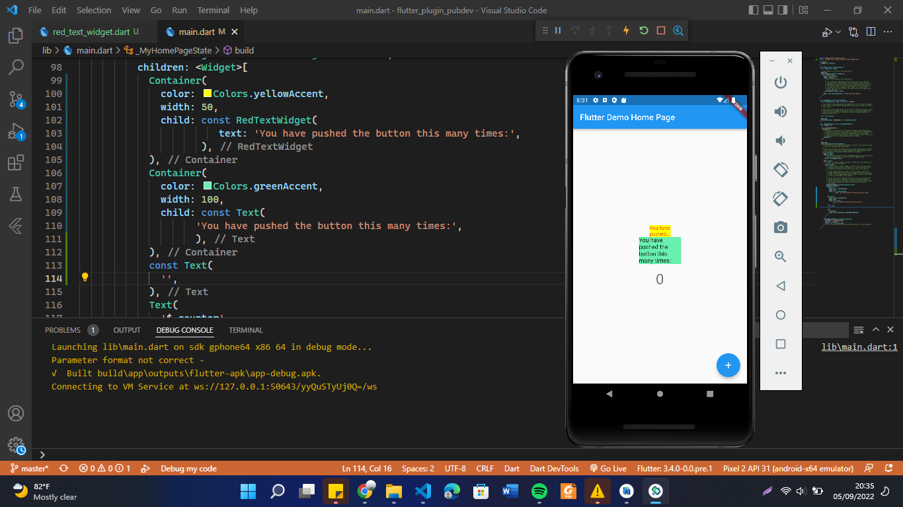

# flutter_plugin_pubdev

A new Flutter project.

# Tugas Praktikum

## 1. Selesaikan Praktikum tersebut, lalu dokumentasikan dan push ke repository Anda berupa screenshot hasil pekerjaan beserta penjelasannya di file README.md!

- Pada praktikum ini menambahkan plugin auto_size_text dan menerapkannya, yang hasil output project tersebut terdapat perbedaan diantara teks yang dibaris pertama dan baris kedua pernedaanya terdapat pada ukuran font dan warna background.
## 2. Jelaskan maksud dari langkah 2 pada praktikum tersebut!
- Langkah 2 yaitu Proses Menambahkan Plugin auto_size_text dalam project praktikum, yaitu dengan cara  menggunakan perintah "flutter pub add auto_size_text". Jika plugin berhasil ditambahaknan maka pada file pubspec.yaml bagian dependencies akan muncul nama dan versi dari plugin. Pada projek ini menggunakan versi 3.0.0

# 3. Jelaskan maksud dari langkah 5 pada praktikum tersebut!

# 4. Pada langkah 6 terdapat dua widget yang ditambahkan, jelaskan fungsi dan perbedaannya!

# 5. Jelaskan maksud dari tiap parameter yang ada di dalam plugin auto_size_text berdasarkan tautan pada dokumentasi ini ! 
